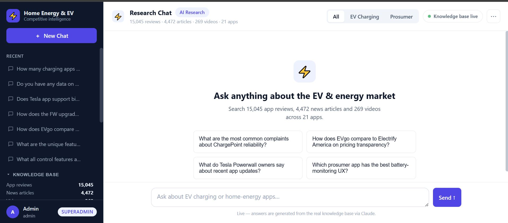
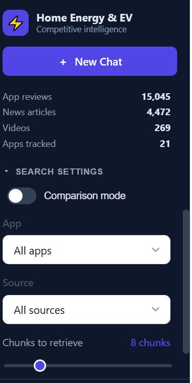
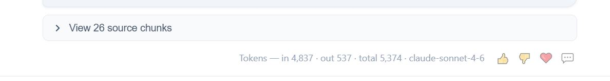
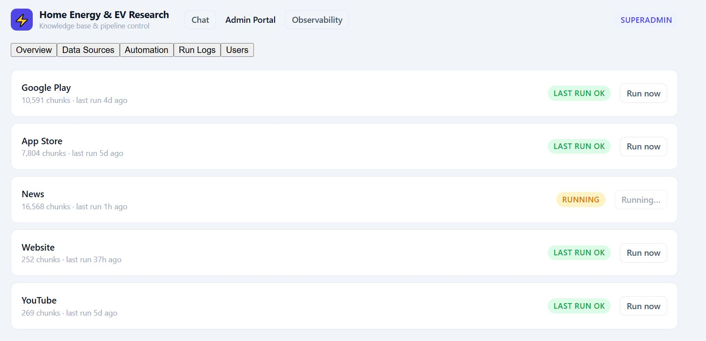
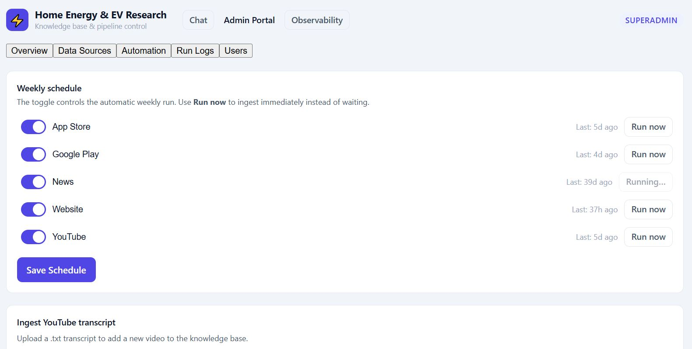

# ⚡ Home Energy & EV App Research — RAG Knowledge Base

Competitive intelligence platform for **EV charging** and **prosumer/home energy** apps in the North American market. Ask questions in plain English; get answers grounded in 17,000+ chunks of real app reviews, news articles, YouTube transcripts, and web pages.

---

## What it does

- **RAG chat** — ask anything about ChargePoint, EVgo, Enphase, Tesla Powerwall, etc. and get Claude-powered answers backed by real user reviews and press coverage
- **Dual-category** — switch between EV Charging apps and Prosumer/home energy apps, or query both at once
- **Comparison mode** — automatically pulls the top chunks from every app in a category side-by-side
- **Source citations** — every answer links back to the exact review, article, or video it drew from
- **Multi-user, role-gated** — login required; admins get a full pipeline control panel and observability dashboard

---

## Target apps

| Category | Apps |
|---|---|
| **EV Charging** | ChargePoint · EVgo · Blink · PlugShare · Electrify America · FLO · EVCS · Shell Recharge · Tesla |
| **Prosumer / Home Energy** | Tesla Powerwall · Enphase Enlighten · SolarEdge mySolarEdge · Emporia · Sense · SunPower · Generac PWRview · Span |

---

## Knowledge base

| Source | Chunks |
|---|---|
| Google Play reviews | 5,973 |
| App Store reviews | 3,687 |
| News (RSS) | 1,443 |
| Web pages | 112 |
| YouTube transcripts | 66 |
| **Total** | **17,642** |

---

## Architecture

```
Local pipeline (Windows)
  → scrapers: Google Play · App Store · News RSS · YouTube · Web Pages
  → chunker (512 tok / 64 overlap, tiktoken cl100k_base)
  → embedder (BAAI/bge-small-en-v1.5, 384 dims, CPU)
  → upsert → pgvector on DigitalOcean Managed Postgres (blr1)

Streamlit chat UI
  → user query → embed → cosine similarity search (top-K)
  → Claude claude-sonnet-4-6 → streamed answer + source citations
```

---

## User flows

### 1. Login

Visit the app URL. You land on a centred login card — enter your username and password to proceed. Wrong credentials show an inline error.


---

### 2. Empty state & example questions

After login, a fresh session shows four example question pills. Clicking one pre-fills the chat input and fires the query immediately.



---

### 3. Asking a question

Type any question in the chat input at the bottom and press Enter (or click the send button).

The sidebar filter state determines retrieval:
- **Category** — EV Charging, Prosumer, or All
- **App** — a specific app or all apps in the category
- **Source** — Google Play, App Store, News, Web Pages, YouTube, or all
- **Chunks to retrieve** — slider (default 8, max 25)
- **Min similarity score** — slider (default 0.45); chunks below this threshold are dropped before Claude sees them

A status widget shows retrieval progress. The answer streams in once chunks are found.



---

### 4. Source citations

Below every AI answer, an expandable **"View N source chunks"** panel lists each retrieved chunk with:
- App name
- Source badge (Google Play / App Store / News / Website / YouTube)
- Similarity score



---

### 5. Feedback & token info

Below every assistant message a one-line row shows token usage (input · output · total · cache read · model) and four feedback icons:

| Icon | Action |
|---|---|
| 👍 | Mark answer helpful |
| 👎 | Mark answer unhelpful |
| ❤️ | Mark as a great answer |
| 💬 | Toggle a free-text comment box (100 chars, auto-saved) |

Clicking an active icon again deselects it. Feedback is persisted to Postgres.

---

### 6. Comparison mode

Toggle **"Comparison mode"** in the sidebar Search Settings section. The slider switches to **"Chunks per app"** (2–5). On submit, the retriever pulls the top N chunks from every app in the selected category and sends them all to Claude — ideal for cross-app questions like _"How does Enphase compare to SolarEdge on battery UX?"_


---

### 7. Session management

- **＋ New Chat** button at the top of the sidebar starts a fresh session
- **Recent Chats** lists your previous sessions, titled by the first message (up to 40 chars)
- Click any session to switch to it; the active one is highlighted
- The **×** button next to a session deletes it (with its messages)


---

### 8. Knowledge Base panel

Click **▸ Knowledge Base** in the sidebar to expand a breakdown of chunk counts per source. Refreshes every 5 minutes from the live DB.

---

### 9. Admin Portal *(superadmin / superuser only)*

Accessible from the **Tools** section in the sidebar. Five tabs:

#### Overview
At-a-glance KPIs: total chunks, last pipeline run per source, currently-running jobs, next scheduled run.

#### Data Sources
Per-source chunk counts broken down by app. Superadmins can trigger a manual pipeline run for any source. A running job shows a spinner and live log tail.

#### Automation
Weekly pipeline schedule per source — enable/disable each source and set the day-of-week it should run. Superadmins can save changes; superusers see read-only state.

#### Run Logs
Full history of every pipeline execution: source, start time, duration, chunks added, status (success / failed). Filterable by source.

#### Users *(superadmin only)*
Full user management:
- **Add user** — set email (used as username), display name, role, and auto-generate or set a password
- **Change role** — promote/demote between superadmin · superuser · user
- **Reset password** — generate a new random password with one click
- **Delete user** — removes the account (irreversible)
- **Shareable credentials block** — copy-paste-ready block for onboarding new users





---

### 10. Observability Dashboard *(superadmin / superuser)*

Accessible via **📊 Observability** in the sidebar Tools section.

- **KPI tiles** — total queries, avg latency, error rate, avg tokens
- **Daily query volume** — bar chart over trailing 30 days
- **Latency trend** — retrieve ms vs generate ms over time
- **Token trend** — input vs output tokens per day
- **App distribution** — which apps are queried most
- **Recent queries** — table of last 50 queries with question, answer snippet, chunks returned, scores
- **Recent errors** — any failed queries
- **RAGAS evaluation** — faithfulness, answer relevance, context precision scores; run a batch eval on demand


---

## Running locally

```bash
# 1. Activate the venv
.venv\Scripts\activate

# 2. Start the app
streamlit run rag/chat_ui/app.py
```

Opens at http://localhost:8501

---

## Running the data pipeline

```bash
python pipeline/run_pipeline.py --source google_play
python pipeline/run_pipeline.py --source app_store
python pipeline/run_pipeline.py --source news
python pipeline/run_pipeline.py --source web_pages
python pipeline/run_pipeline.py --source youtube
```

> **Note:** YouTube scraping is IP-rate-limited. Transcripts should be added manually via `pipeline/scrapers/parse_transcripts.py`.

---

## Production deployment

Deployed on a DigitalOcean Droplet behind nginx, running the Streamlit app as a systemd service (`ev-research.service`, port 8501 → nginx :80). Deployment details (host, SSH access) are kept out of this public repo — see internal ops notes.

---

## File structure

```
C:\EVMarketResearch\
├── config/
│   ├── .env                   API keys & DB credentials
│   └── users.yaml             Bcrypt-hashed user accounts
├── pipeline/
│   ├── scrapers/              Google Play, App Store, News RSS, YouTube, Firecrawl
│   ├── processing/            Chunker (512 tok / 64 overlap) + Embedder (bge-small)
│   └── ingestion/upsert.py   pgvector upsert
├── rag/
│   ├── retriever.py           Embed → search → Claude
│   ├── api/query.py           FastAPI POST /query
│   └── chat_ui/
│       ├── app.py             Streamlit chat UI
│       └── pages/
│           ├── 1_Admin_Portal.py
│           └── 2_Observability.py
└── data/raw/text/             Scraped JSON per source per app
```

---

## Tech stack

| Layer | Choice |
|---|---|
| LLM | Claude claude-sonnet-4-6 (Anthropic API) |
| Embedding | BAAI/bge-small-en-v1.5 · 384 dims · local CPU |
| Vector DB | pgvector on DigitalOcean Managed Postgres |
| Chat UI | Streamlit |
| Auth | streamlit-authenticator + bcrypt |
| Scraping | google-play-scraper · app-store-scraper · feedparser · Firecrawl · yt-dlp |
| Eval | RAGAS |
